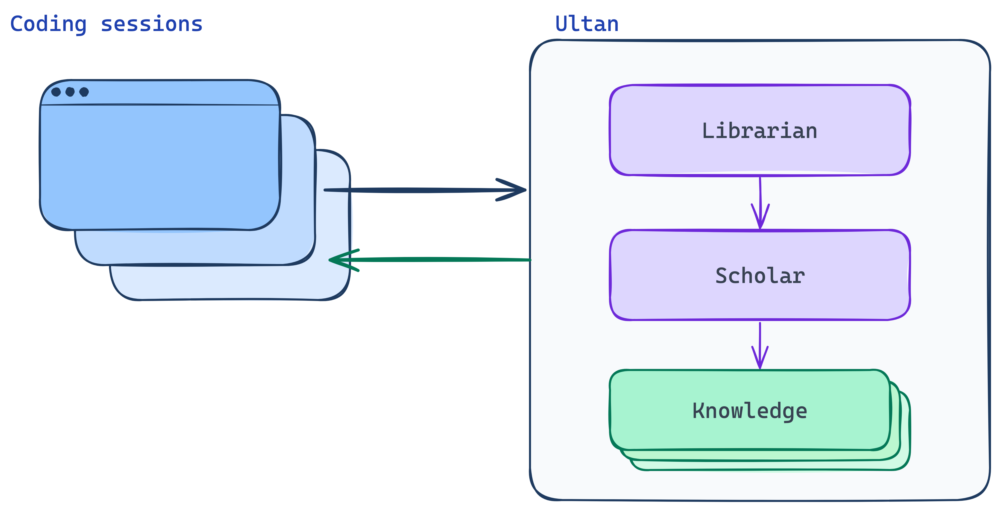
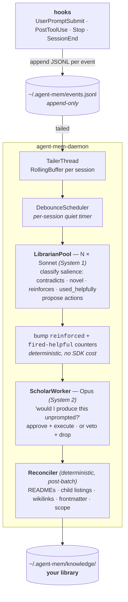

# Ultan

A personal memory system for coding agents. Built for Claude Code; lives outside any one session, project, or machine.

> ⚠️ **Beta.** Under active development. Expect breaking changes and rough edges — feedback welcome.

> *"Show me a man who has read all of the books of one of the major branches of knowledge — say, military history — and I'll show you a man more ignorant than the merest churl. For while he has read, others have written; and the body of available knowledge has grown so much faster than his understanding of it that he is, on balance, less learned at the end of his studies than at their beginning."*
>
> — Master Ultan, Gene Wolfe

## Why this exists

The memory features that exist today — `CLAUDE.md`, Cursor rules, ChatGPT memory, the various provider built-ins — are *there* but I always felt they did not surface the lessons that had been learned well enough. They seem to be rarely useful, bloat the context, get ignored and when they fire they often feel trivial: shallow grep against a static rules file, no judgment about what's worth remembering vs what isn't, no idea what's stale, no composition with the current turn. I was tired of teaching the same agent the same thing over and over and I did not want to have to manually curate an ever changing set of shared knowledge per project and globally.

So I wondered what could be achieved with a much more advanced system. There are obviously many alternatives but none had all the features that I wanted. Real memory is salience-gated at write time, decays without reinforcement, mutates on retrieval, resists deletion of high-importance traces, and uses different mechanisms for different latencies (ambient familiarity, deliberate recall, fast suppression). So we took the neurology seriously and built towards it — a curator pair (currently Sonnet + Opus) gating writes by surprise magnitude; three retrieval tiers each tuned to a different cognitive analog; surfacing-aware decay with optional arousal pinning; an opt-in mutation/reconsolidation pathway; archive-don't-delete so contradictions can resurrect old traces. Tokens cost something — it's deliberately token-heavy, and the curator runs on your Claude Code subscription (Max/Pro quota, not a metered API bill) — but less than the friction of repeating yourself.

Ultan watches your conversations as you work, learns your preferences and conventions, and surfaces them when they matter. It's the "remember when you told me to always use uv" that you wish Claude already did natively, except organised, deduplicated, validated, and proactively consulted before the agent interrupts you to ask something you've already answered.

It's your library. On your disk. In plain markdown. You can `ls` it, `cat` it, `git` it.

<p align="center">
  <a href="docs/librarian-scholar.png">
    
  </a>
</p>

---

## Quick start

Ultan installs as a native **Claude Code plugin** — no editing `settings.json`, no
daemon to babysit. You just need [`uv`](https://docs.astral.sh/uv) on your `PATH`; the
plugin uses it to provision Ultan's runtime on first use.

Inside Claude Code:

```text
/plugin marketplace add nickroci/ultan
/plugin install ultan@ultan      # choose "user" scope to enable it in every project
/reload-plugins                  # load the hooks + MCP into the running session
```

> ⏳ **`/plugin install` looks frozen — it isn't.** Claude Code shows **no progress
> while it downloads the plugin, which can take a minute**. Don't cancel; the
> "plugin changed" confirmation appears when it's done. After that, the first session
> provisions Ultan's retrieval stack (torch + the embedding/rerank models — a few
> hundred MB) in the background, and you can keep working while it finishes.

That's it. Skills and slash commands hot-load the instant you install; `/reload-plugins`
pulls in the hooks and the MCP server. **A full Claude Code restart is not required** —
your next prompt kicks off provisioning automatically (a fresh session works too; you
don't need one).

> 🩺 **Wondering what it's doing? Ask Claude to run `ultan doctor`.** It reports
> whether the background install is still running, the daemon's state (warming /
> healthy / idle), priming latency, and capture freshness — at any stage, even
> mid-install.

The plugin provisions that retrieval stack into its private storage **in the
background**, triggered by whichever happens first: the plugin's MCP server starting
(right after install/reload — the spec has no install-time script, so this is the
earliest the plugin gets to run), a fresh session's `SessionStart`, or your next
prompt. All three funnel into one lock-guarded installer, so they never race. Until
it finishes, priming falls back to a fast lexical scan; after that the daemon
**lazy-starts on demand**. Models download anonymously from HuggingFace — see
*First-start expectations* below.

You now have:

- `/ultan <text>` to save a memory, `/ultan-advisor <question>` to consult the library
- the `ultan-search` skill and the `ultan_recall` MCP tool
- automatic priming on every prompt
- everything under `~/.agent-mem/knowledge/` as plain markdown — local, no cloud, no telemetry

### Where your memories live

Everything Ultan owns lives under **`~/.agent-mem/`** on your local disk — no cloud sync, no hosted database, no telemetry. Override with `AGENT_MEM_HOME=/some/other/path` if you want a different root.

| Path | What's in it |
|---|---|
| **`~/.agent-mem/knowledge/`** | **Your library — plain markdown.** This is the data; everything else in this table is derived or transient. `ls`, `cat`, `git init` it. |
| `~/.agent-mem/events.jsonl` | Append-only stream of hook events. Hooks write, the daemon tails. Truncates on rotation. |
| `~/.agent-mem/daemon.log` | Rotated daemon log (~5 MiB cap). |
| `~/.agent-mem/.bm25.idx`, `.embeddings.idx` | Search indexes over the library. Rebuilt automatically when the library changes. |
| `~/.agent-mem/sweep-state.json` | Last-decay-sweep timestamp (24h cooldown). |
| `~/.agent-mem/pending-nudges.md` | Scholar writes nudges here; the hook reads and clears them on the next turn. |
| `~/.agent-mem/cost.json` | Running tally of LLM spend across Librarian / Scholar / Advisor calls. |
| `~/.agent-mem/runs/` | Per-call audit log (cost, duration, decisions) + full LLM transcripts (7-day TTL). |

See *Storage on disk* below for the full layout including the folders inside `knowledge/`.

### First-start expectations (model downloads)

The Tier-1 retrieval pipeline uses two open HuggingFace models, downloaded
into your local cache on first daemon start (`~/.cache/huggingface/`,
re-used by every subsequent run):

| Model | Role | Size on disk |
|---|---|---|
| [`nomic-ai/nomic-embed-text-v1.5`](https://huggingface.co/nomic-ai/nomic-embed-text-v1.5) | sentence-transformer embedder (asymmetric query/document, Matryoshka 768→128) | ~270 MB |
| [`cross-encoder/ms-marco-MiniLM-L-12-v2`](https://huggingface.co/cross-encoder/ms-marco-MiniLM-L-12-v2) | reranker that scores (query, body) pairs after RRF fusion | ~130 MB |

Both are downloaded **anonymously** — no HuggingFace account or token is
needed. If you have outbound network restrictions, pre-cache them on a
machine with internet access and copy `~/.cache/huggingface/hub/`
across. nomic-embed-v1.5 requires `trust_remote_code=True` because its
RoPE attention module ships as custom code in the model repo; the daemon
sets this only for the nomic model name, not as a global default.

Boot time on a warm M-series Mac (cold models, warm HF cache):

- ~1 s for the BM25 index
- ~17 s for the embedding model to load + index the library + JIT-warm
  the query-side MPS kernels
- ~5 s for the cross-encoder to load + run a full-pipeline warmup query

Total: ~25 s from `uv run agent-mem-daemon -v` to "priming RPC ready".
The startup runs a single end-to-end priming search before opening the
socket — by the time the hook can connect, every MPS kernel in the
retrieval path is JIT-compiled, so the first real request is hot.

Steady-state resident footprint: **~2.5 GB physical memory** on Apple
Silicon (unified memory, includes Metal device-side allocations); peak
of ~3.4 GB during boot warmup. On a discrete-GPU box the split between
RSS and GPU memory looks different; on CPU-only hardware the daemon
still works but per-request rerank latency drifts up.

When the daemon is running, the `UserPromptSubmit` hook makes a Unix-socket
call into it (hard cap 2 s; warm steady-state ~300-500 ms) to get a
priming snippet keyed on your *current prompt* (not the last batch's
curation). When the daemon is down, the hook falls back to a tiny
in-process lexical scan so you still see relevant entries.

To save a memory explicitly: `/ultan never deploy to prod without my explicit OK`.

To ask before asking the user: `/ultan-advisor should I use respx or hand-roll an httpx mock?`.

## Design, in one paragraph

Ultan is modelled — deliberately, at the level of the architecture, not as decoration — on how mammalian brains decide what to remember and how to surface it again later. Three ideas drive the whole system:

<p align="center">
  <a href="docs/architecture.png">
    
  </a>
</p>

1. **Surprise gates storage.** Memory is not a transcript. The brain encodes events that violate prediction; novelty and reward-prediction-error are the dopaminergic signals that license hippocampal write (Lisman & Grace, 2005; Schultz, Dayan & Montague, 1997). Ultan's curator does the same: it captures an entry only when the user has told it something a competent assistant would *not* have produced unprompted. No surprise, no write. The three salience signals — **contradicts**, **novel**, **reinforces** — are direct analogues of prediction-error, novelty, and reactivation/consolidation (Sinclair & Barense, 2019).
2. **Two systems, asymmetric bars.** Fast recall-tuned detection, slow precision-tuned deliberation — System 1 and System 2 (Kahneman, 2011). The Librarian (Sonnet) flags candidates aggressively. The Scholar (Opus) verifies them slowly and decides whether to commit. Cheap-and-broad gates expensive-and-narrow, the way the brain's salience network gates the prefrontal cortex.
3. **Three retrieval tiers.** Humans don't query memory uniformly. They get ambient familiarity-driven priming, deliberate hippocampal recollection, and a fast orbital-PFC "stop signal" when the environment matches a stored constraint (Yonelinas, 2002; Aron, Robbins & Poldrack, 2014). Ultan exposes each as a separate mechanism with its own latency budget (§ *Three retrieval tiers*, below).

### References

- Lisman, J.E. & Grace, A.A. (2005). *The Hippocampal-VTA Loop: Controlling the Entry of Information into Long-Term Memory.* Neuron, 46(5), 703–713.
- Schultz, W., Dayan, P. & Montague, P.R. (1997). *A neural substrate of prediction and reward.* Science, 275(5306), 1593–1599.
- Yonelinas, A.P. (2002). *The nature of recollection and familiarity: A review of 30 years of research.* Journal of Memory and Language, 46(3), 441–517.
- Kahneman, D. (2011). *Thinking, Fast and Slow.* Farrar, Straus and Giroux.
- Aron, A.R., Robbins, T.W. & Poldrack, R.A. (2014). *Inhibition and the right inferior frontal cortex: one decade on.* Trends in Cognitive Sciences, 18(4), 177–185.
- Sinclair, A.H. & Barense, M.D. (2019). *Prediction Error and Memory Reactivation: How Incomplete Reminders Drive Reconsolidation.* Trends in Neurosciences, 42(10), 727–739.
- Collins, A.M. & Loftus, E.F. (1975). *A spreading-activation theory of semantic processing.* Psychological Review, 82(6), 407–428.

---

## What it does

- **Surprise gates the write** (see *Design, in one paragraph*, above). The curator asks, of every candidate, "would a competent assistant produce this advice unprompted?" If yes — already in the model's baseline knowledge, no information added by storing it — skip. If no, capture. Three salience signals trigger a write, mapping directly onto prediction-error, novelty, and reactivation:
  - **Contradicts** an existing entry — user has changed their mind. Highest priority. Deprecates the old, writes the new. *(Prediction-error: stored belief was wrong.)*
  - **Novel** — not in the library, not derivable from the model's training (user-specific facts, strict overrides of defaults, idiosyncratic preferences). *(Novelty: no matching trace exists.)*
  - **Reinforces** — user repeated something we already have. No new entry; daemon bumps a `reinforced` counter on the existing entry to track how often it's reasserted. *(Reactivation: existing trace strengthened, not duplicated — Sinclair & Barense, 2019.)*
- **Use-tracking, not a write trigger.** A fourth `salience_signal` value, **used_helpfully**, fires when the agent actually *relied on* a surfaced entry to answer — the Librarian judges genuine reliance (a mere mention is not use; disagreement stays *contradicts*), and the Scholar deterministically bumps a separate `fired-helpful` counter on the cited entry, deduped per turn so a re-scanned turn never double-counts. It is the positive-evidence half of the prefrontal-inhibition analog (see *Roadmap*), kept distinct from the three write-gating signals above. *(Now consumed by Tier-1 ranking as a gentle usefulness tiebreaker; feeding it into decay resistance is still a TODO — see Roadmap.)*
- **Two-tier curator with asymmetric bars.** The Librarian (Sonnet) does fast salience detection — low bar, recall-tuned. The Scholar (Opus) deliberates — higher bar, precision-tuned. System 1 gates System 2; cheap-and-broad gates expensive-and-narrow.
- **Organises a real library, not a flat pile.** Topical hierarchy emerges from content. Every folder has a README. ≤5 entries per directory before splitting. Auto-maintained child listings between marker comments. Wikilinks validate. Frontmatter validates. Scope/path agreement enforced.
- **Three slash commands** wire it into Claude Code without ceremony:
  - `/ultan <text>` — drop something into memory now, no extraction needed.
  - `/ultan-install` — wire the hooks into the current project's `.claude/settings.json`.
  - `/ultan-advisor <question>` — query the library before asking the user a preference question. The advisor finds relevant entries (Sonnet, BM25 + embeddings + Read), writes a referenced answer (Opus), and clearly distinguishes stored knowledge from its own opinion. *Always cheaper to check than to ask.*
- **Pure markdown store.** No database. The library is `~/.agent-mem/knowledge/` — `ls`, `cat`, `git` it. Two derived indexes alongside (`.bm25.idx` for keyword, `.embeddings.idx` for semantic) auto-rebuild on drift.

### Three retrieval tiers

The agent can't afford to query the library for everything it's about to do, and humans don't either — retrieval is layered. Familiarity-based priming via spreading activation (Collins & Loftus, 1975); explicit hippocampal recollection (Yonelinas, 2002); and the rapid orbital-PFC "stop signal" that interrupts an in-flight action when it conflicts with a stored constraint (Aron, Robbins & Poldrack, 2014). Ultan implements all three:

| Tier | Cognitive analog | Latency | Trigger | What it does |
|---|---|---|---|---|
| **1. Ambient priming** | Familiarity / spreading activation (Collins & Loftus, 1975) | <2s (Unix-socket round trip to warm daemon; budget enforced by the hook) | Hook fires a priming RPC to the daemon on every UserPromptSubmit | Top **3** most-relevant entries injected as `additionalContext` on every UserPromptSubmit, **each with a short body excerpt** so the agent can cite the actual rule rather than guess from the title. Bullets carry freshness (`★` for entries updated in the last 7 days) and kind markers (`[C]` convention, `[P]` preference, `[F]` finding, `[W]` warn). **Per-session dedup**: entries already surfaced this session don't re-surface — once shown, they're in the agent's context. Three-stage retrieval: BM25 + sentence-transformer embeddings (nomic-embed-text-v1.5) → RRF fusion → cross-encoder rerank (ms-marco-MiniLM-L-12-v2), boosted by `reinforced` counter, project-scope prior (current-project bonus, cross-project penalty), and a gentle `fired-helpful`/`fired` usefulness tiebreaker. ≤1500 char budget. |
| **2. Deliberate recall** | Hippocampal recollection (Yonelinas, 2002) | 30-60s | `/ultan-advisor <question>` invocation | Sonnet Librarian searches deeply, Opus Scholar synthesises a referenced answer. The drill-down when the priming snippet isn't enough. |
| **3. Acute notice** | Orbital-PFC stop signal (Aron et al., 2014) | <100ms synchronous | PreToolUse hook on every tool call | Default `advise`: pattern-matches the tool call against entries with `block_triggers`; on match, emits an `additionalContext` FYI — *"📚 Library note: [[X]] applies here"* — and the tool proceeds. **The agent decides.** Opt-in `severity: block` is reserved for genuinely dangerous actions (`rm -rf /`, force-push to main); only then does the hook hard-deny. Like a human noticing a relevant memory mid-action: noticed, not paralysed. |

The Scholar still owns a **soft nudge pipeline** orthogonal to these — when the Librarian sees a stored preference matching the rolling buffer, the Scholar can approve a nudge to `pending-nudges.md` for injection on the next turn. Budget: 1/turn, 3/session.

### The library is a graph

The library is structurally a graph: folder hierarchy gives the tree, wikilinks (`[[path/to/entry]]`) give cross-links that turn it into a DAG. The Scholar maintains both as first-class objects — `add_wikilink` is one of its action verbs, every folder README's child listing is auto-reconciled between marker comments, and every wikilink is validated on write (the Librarian's proposal is dropped if a link doesn't resolve).

Retrieval over the graph is split across tiers:

- **Tier 1 (priming) is text-only** — three-stage retrieval: BM25 + sentence-transformer embeddings (nomic-embed-text-v1.5) fused via RRF, then re-ordered by a cross-encoder reranker (ms-marco-MiniLM-L-12-v2) co-attending over each `(query, body)` pair, and finally boosted by the `reinforced` counter, project-scope prior (current-project bonus + cross-project penalty), and a gentle `fired-helpful`/`fired` usefulness tiebreaker. The top 3 survivors are rendered with body excerpts, freshness markers, and one-character kind tags; per-session dedup suppresses entries already shown to the agent. The retriever does not traverse the graph; it returns top-k entries by relevance, with wikilinks appearing in the output as *hints*.
- **Tier 2 (deliberate recall) is agent-driven graph traversal.** The agent sees wikilinks in priming context and follows them via the `ultan-search` skill, which returns the entry plus its local neighborhood — siblings, subfolders, parent README — in one read. The agent decides which edges to follow and when to stop, the same "memory as tools" pattern Letta and Wire have shown beats pre-baked retrieval expansion on cross-document queries.

The deliberate choice: deterministic-and-cheap text retrieval at always-on Tier 1, semantic-and-expensive graph traversal at on-demand Tier 2. PageRank-style structural expansion at Tier 1 is a possible addition (see *Roadmap*), not a current capability.

---

## Development setup

For hacking on Ultan itself, or running from source without the plugin. This is the
manual path the plugin automates — you wire the hooks yourself and run the daemon
directly from the repo.

```bash
# 1. Sync the daemon's deps (uv-managed)
cd daemon && uv sync --group dev

# 2. Sync the search CLI (separate venv, shared BM25 implementation).
#    Pulls in sentence-transformers + einops; HuggingFace model weights
#    are downloaded on first daemon start (see step 4 below).
cd ../tools/search && uv sync

# 3. Install the slash commands and hooks
#    - /ultan, /ultan-install, /ultan-advisor live at ~/.claude/commands/
#    - `/ultan-install` writes hooks into ~/.claude/settings.json (GLOBAL — every
#      Claude Code project). One daemon per machine serves the whole library
#      across every repo, so global is the recommended default.
#    - `/ultan-install --project` if you'd rather scope to one repo only.
#    NOTE: don't run this if you've installed the plugin — the hooks would double-fire.

# 4. Start the daemon (foreground; logs to ~/.agent-mem/daemon.log). One per
#    machine — it listens on ~/.agent-mem/priming.sock and answers Tier-1
#    priming requests from every hook on every project.
cd /path/to/ultan/daemon && uv run agent-mem-daemon -v
#    (nohup, tmux, or a launchd plist if you want it persistent — auto-supervision
#     not yet implemented.)

# 5. Open Claude Code in any project (no per-project setup needed once the
#    hooks are global) and work normally. Entries land under
#    ~/.agent-mem/knowledge/ as the Scholar approves them.
```

---

## How it works (the short version)



Design discipline that survived live testing:

- **The model writes nothing.** The curator's tools are read-only (read · grep · BM25 · embedding); the LLM returns a typed, validated *set of actions* and a deterministic executor is the only thing that touches disk. Paths are checked at the boundary, never trusted from the prompt.
- **No silent fix-ups.** The Scholar can only approve-and-execute or veto-and-drop. If the Librarian got the path wrong, the proposal is lost — recurs next session if real. Forces the Librarian to be careful.
- **Schema as single source of truth.** The output models (`ScholarDecisions` / `LibrarianProposal`) *are* the tool schema the model fills in and the validators it must satisfy. Change the schema and both the model's contract and the boundary checks move with it.
- **Auto-reconciled READMEs.** Every folder's README has a `<!-- ULTAN:children (auto) -->` marker block. The LLM writes prose above; the daemon keeps the listing in sync after every batch. No drift.
- **Typed output over the subscription SDK.** The curator runs on your Claude Code subscription via `claude-agent-sdk` — never the metered API — yet still gets Pydantic-AI-style discipline, through a small in-house shim (`typed_agent.run_typed`). The model "returns" by calling a `submit_result` tool whose input schema *is* the Pydantic output model; a validator runs at that boundary, and anything malformed (an unresolvable wikilink, an over-cap directory, unparseable frontmatter) is handed straight back as the tool result so the model self-corrects in-band. No JSON scraped from free text, no post-hoc repair — bad data never crosses the boundary. Pydantic-AI itself only speaks the metered API, so we kept its ergonomics without its billing.
- **Persistent tailer offset** so daemon restarts resume mid-stream instead of seeking to EOF and losing the events that arrived during downtime.
- **No literal secrets in the library.** Both curator prompts are explicit: the Librarian must not quote credentials in any field of a proposal (API keys, OAuth secrets, GitHub PATs, AWS keys, `sk-*` keys, private-key blocks, connection strings with passwords, JWTs); the Scholar treats the same as a hard-veto invariant. Memory is plain markdown on disk and often git-tracked — defence in depth at both stages.

---

## Prior art

Ultan is forked from and inspired by two earlier projects. Heavy credit to both authors:

- **[coleam00/claude-memory-compiler](https://github.com/coleam00/claude-memory-compiler)** — provided the codebase skeleton: hook architecture (`SessionEnd` → flush → daily log → compile), the recursion-guard pattern via `CLAUDE_INVOKED_BY`, and the Karpathy-style knowledge layout (daily, concepts, connections, qa, index, log). The whole writes-via-Claude-Agent-SDK pattern with `permission_mode="acceptEdits"` and the `claude_code` preset is from here, near-verbatim.
- **[mann1x/claude-hooks](https://github.com/mann1x/claude-hooks)** — the daemon pattern, the threaded worker model, and the discipline around fault isolation in parallel pools. We cribbed the `ThreadPoolExecutor` fan-out from their `_parallel.py` and the threading reasoning from `daemon.py` (their explicit choice of stdlib `threading` over asyncio — *"hooks are I/O-bound; GIL releases during socket reads; small ThreadPoolExecutor gives near-linear speedup without the rewrite cost"* — is exactly what made our parallel daemon tractable).

What we deliberately didn't borrow from `claude-hooks`: the Qdrant / pgvector / sqlite-vec providers, the API proxy, the dashboard, the LSP engine. Excellent code, all of it — just not what a personal memory store needs.

---

## Layout

```
agent-mem/
  README.md             ← this file
  daemon/               ← the long-lived event-ingest daemon
    agent_mem_daemon/   ← package
    tests/              ← pytest suite (see Status below for current count)
    pyproject.toml      ← uv-managed
  src/                  ← Phase-0 hook layer (forked from claude-memory-compiler)
    hooks/              ← UserPromptSubmit, PostToolUse, Stop, ...
    scripts/            ← flush / lint / query
    AGENTS.md           ← entry-schema reference
  tools/
    ultan/              ← /ultan, /ultan-install, /ultan-advisor scripts
    search/             ← `agent-mem search` CLI + BM25 indexer (shared library)
  docs/
    LIBRARIAN_PROMPT.md ← Librarian role reference
    SCHOLAR_PROMPT.md   ← Scholar role reference
    SCHEMA.md           ← entry schema reference
```

Storage on disk:

```
~/.agent-mem/
  events.jsonl          ← append-only; hooks write, daemon tails
  daemon.log            ← rotated daemon log
  daemon.pid            ← acquired on start
  daemon.offset.json    ← persistent tailer offset for restart-safe resume
  pending-nudges.md     ← Scholar writes, hook reads + clears + injects
  cost.json             ← running spend tally
  runs/<date>.jsonl     ← per-call audit (cost, duration, decisions, parsed_ok)
  runs/<ts>-<role>-<sid>.md  ← full prompt + response transcripts (7-day TTL)
  knowledge/            ← your library
    README.md
    index.md            ← catalog
    log.md              ← Scholar action log (writes + vetoes + reasoning)
    global/             ← cross-project entries (Librarian organises sub-topics dynamically)
    projects/<slug>/    ← per-repo entries
    _archive/           ← archived entries
```

---

## A note on cost

**Ultan is token-heavy by design, and it runs on your Claude Code subscription.** The curator (Librarian + Scholar) calls models through `claude-agent-sdk` — the same auth your Claude Code session already uses — so on Max/Pro the usage counts against your plan's limits, **not** a metered per-token bill. It trades a generous slice of that quota for richer memory and lower friction. Expect roughly:

- **Librarian (Sonnet)** runs after each session's quiet period (per-session debounce, default 30s). With moderate activity that's ~10-30 invocations per working day per project. Each is a few thousand input tokens (prompt + library snapshot + buffer) plus a few hundred output tokens.
- **Scholar (Opus)** runs in batches — every 3 Librarian packets or 60s, whichever first. Each batch is one Opus call: prompt + accumulated proposals, ~30s wall time, a few thousand input + a few hundred output tokens.
- **Ambient priming (Tier 1)** is daemon-side BM25 + embeddings + cross-encoder rerank, **no LLM cost**, but it injects up to 1500 chars into every UserPromptSubmit — call it ~400 tokens of prompt overhead per turn.
- **Advisor (`/ultan-advisor`)** is one Sonnet call (Librarian step) + one Opus call (Scholar synthesis) per invocation.
- **PreToolUse Tier 3** is pure deterministic regex match, **no LLM cost**, sub-100ms.

On a Max/Pro plan this is real quota: active dogfooding across projects can chew through a meaningful slice of your usage window, and on a busy day you may hit your plan's rate limit. When that happens the affected batch is simply dropped and its lessons recur next session — the daemon never silently falls back to a paid API. (If you've instead pointed the Claude Code CLI at a metered `ANTHROPIC_API_KEY`, the same volume runs roughly $5-20/day pay-as-you-go.)

If that's too rich for your workflow: turn off the daemon entirely and use just the slash commands (`/ultan`, `/ultan-advisor`) — the curator stops running, but the explicit-write and explicit-query paths still work. You lose ambient priming, automatic extraction, and proactive nudges, but you keep the markdown library and the on-demand advisor.

## Roadmap

Three known gaps relative to where the bio framing points.

### Tier 1 graph signal

Tier 1 priming uses BM25 + embeddings (nomic-embed-text-v1.5) + RRF + cross-encoder rerank (ms-marco-MiniLM-L-12-v2) + `reinforced` + project-scope prior + a `fired-helpful`/`fired` usefulness tiebreaker. One cheap structural signal still sits unused:

- **Wikilink-density boost** — heavily inbound-linked entries are load-bearing (PageRank's intuition, cheap to compute on a few-thousand-entry library). One extra term added before the cross-encoder rerank (so densely-linked entries get a better chance of surfacing into the rerank's candidate pool).

Doesn't require architectural change — it's a small addition in `priming.py` before `_rerank_candidates`. The agent-driven Tier 2 traversal stays as-is; this is purely about giving Tier 1 a structural prior on top of the relevance-only signal the cross-encoder already provides.

### Reflective abstraction (offline integration of leaf episodes)

**Slice 1 shipped (`abstract_entries`).** Ultan now has a bottom-up pass that synthesises higher-order rules from accumulated leaf entries, closing one of the largest deltas from a mammalian system: hippocampal–neocortical dialogue during offline periods produces transitive inferences and schema abstractions that no single episode contains (Schlichting & Preston 2015; Eichenbaum 2017; Preston & Eichenbaum 2013). The Scholar was *reactive* — it judged incoming proposals — and is now also *reflective*: it approves or vetoes net-new parent abstractions the Librarian proposes over related leaves. Decay (PR #7) removes unused noise; reflection consolidates the *used* patterns that would otherwise stay as N parallel leaves, so the library no longer has only *flat breadth* — facts can graduate to a higher-order rule. The canonical LLM-side analog is the *reflection* mechanism in Park et al.'s Generative Agents (2023). A-MEM (Xu et al., NeurIPS 2025) — cited below in the Reconsolidation row — does hierarchical evolution of entries on use; reflection here adds the *net-new parent abstraction* step that A-MEM doesn't propose.

**It is one more verb in the Librarian's vocabulary, not a separate clustering daemon.** The Librarian already reads multiple entries and proposes structural changes to the Scholar (`merge_entries`, `split_folder`, `add_wikilink` are all multi-entry-reading-with-judgment actions). `abstract_entries` is *one more verb* in that vocabulary. Cosine clustering would force a topical-summary shape (Park et al. 2023's flavour); the agent-driven path gives us the schema-inference flavour the cited Eichenbaum/Schlichting biology actually describes — *"rule A about python + rule B about JS → abstract rule 'user likes linting across languages'"* (predicts wanting lint in a new language like Rust), not "5 entries about python deps → 1 themed summary." Same pattern as [[projects/agent-mem/conventions/retrieval/no-regex-seed-extraction-use-parallel-search]]: the Librarian is a tool-using agent making judgments, not an algorithm running offline.

**This is surprise-gated, not similarity-gated — the same encoding bar the leaf writes use.** A proposal is approved only when it's a genuine "aha", an integration event with reward-prediction-error signature, not a topical cluster. The biology is specific: only strongly novel-or-congruent items encode (the "mild middle" is dropped) (van Kesteren et al. 2012, SLIMM); insight is the binding of a *remote* association (Jung-Beeman et al. 2004); the aha moment is a reward-prediction-error that drives durable encoding (Kizilirmak et al. 2016); and integration is what lets the hippocampal–prefrontal system make a *novel inference* about an unseen case from separately-stored episodes (Schlichting & Preston 2015; Tse et al. 2007; Behrens et al. 2018). So the gate, enforced in BOTH the Librarian's propose-side prompt and the Scholar's veto-side prompt, has four parts: (1) **remote children** — leaves from different domains, so the link is non-obvious; (2) **predictive lift** — the parent enables a confident call on an unseen case no single child supports; (3) **non-obvious** — a competent assistant wouldn't have stated the rule unprompted; (4) **compresses** — the rule is shorter than its children and regenerates them. The Scholar treats failing the bar as a precision veto. Explicit must-reject patterns (same-surface groupings like "all about yellow things", vague ones like "likes uv + likes ruff → likes fast tools", true-but-worthless ones like "likes lint + likes types → likes good code") are baked into the prompts so the model doesn't over-abstract.

How it works:

- **Action.** `abstract_entries` takes `child_paths` (≥2 existing leaves, enforced by a model validator), a `parent_path`, `parent_title`, and a `parent_body` (full markdown with `type: abstraction` frontmatter and a `[[wikilink]]` to each child). The Librarian identifies candidates during its normal scan using its BM25 + embedding-search tools, not via a periodic clustering pass.
- **Validation.** The same boundary validators every action passes: parent + child paths must be well-formed `.md` inside the knowledge root; `parent_body` frontmatter must parse, carry the required fields, and agree (id/scope) with `parent_path`; every child must already exist (children are being abstracted, so they must be there); the parent is registered as a batch-created path so its own body wikilinks resolve; the parent's directory is counted toward the flat-dir cap.
- **Execution.** The deterministic executor atomically writes the parent, upserts its `index.md` row, appends to `log.md`, and adds a reverse `[[parent]]` backlink into each child's `## Related` section (idempotent — a re-run doesn't pile up duplicate bullets). **Children stay in place** — they are not archived or moved, remain individually retrievable, and stay subject to normal decay. The parent gains its own `reinforced`/decay lifecycle.

`encoding_strength`-derived durability for the parent (a flatter decay slope for high-surprise abstractions) remains a follow-up — it depends on the separate `encoding_strength` field (see *Forgetting* below). Until then the parent ships on the existing `reinforced`/decay lifecycle like any other entry.

Open questions (follow-up slices):

- **Triggering** — under the agent-driven framing, "cadence" mostly evaporates: the Librarian considers abstraction during every normal scan. The real question is what *prompts* the Librarian to look. Options: the existing applies-when match against the rolling buffer (cheap, but biased toward whatever the user just touched); a periodic deep-scan mode that ignores the buffer and just sweeps the library for under-abstracted clusters (more thorough; costs Sonnet tokens); or both (deep-scan as a separate Librarian invocation, e.g. weekly).
- **Restraint heuristics** for the Librarian — what's the minimum number of related leaves before proposing an abstraction is worth the Scholar's attention? What signals "this cluster is cohesive enough to abstract" vs "this is a coincidental keyword overlap"? Probably needs explicit prompt guidance ("only propose when at least N entries clearly imply the same general rule, and the rule isn't already captured by an existing parent").
- **Parent's `encoding_strength` derivation** — `max(children)` (under-specified; over-pins generic parents to outlier child extremity), `weighted average by child reinforcement` (parent strength reflects load-bearing patterns), or `own LLM-judged cohesion score` from the Librarian's proposal (parent strength reflects how well its statement captures the cluster). Affects how parents compete with leaves in retrieval.
- **Reinforcement cascade** — should the parent get a `reinforced` bump when any child is retrieved? Pro: parents that summarise actively-used patterns stay durable. Con: parents will out-accrue children and dominate retrieval, which may or may not be the goal.
- **Folder placement** when children span folders (e.g. python-deps + Go-modules abstracted to "pin dependency versions everywhere") — highest common ancestor, dedicated `abstractions/` subtree, or co-locate with densest child contribution? The Librarian's proposal would name a target; the Scholar judges whether the target is sensible.
- **Composition with decay** — when child entries get archived by the sweep, what happens to the parent? Options: parent stays as standalone abstraction; parent archives when all children archive; parent absorbs children's reinforcement floor and becomes self-sustaining. The first option is probably right (the abstraction has its own load-bearing value separate from the children that seeded it), but pick deliberately.
- **Recursive reflection** — should reflections-of-reflections happen? The hippocampal-cortical analog supports multi-level schema (instances → concepts → categories). Could be a desired property (deep hierarchy) or an explicit non-goal (stay shallow, exactly one level above leaves).
- **`contradicts` voting against synthesised parents** — when new leaves diverge from a parent's claim, how does the Scholar phrase the deprecation? Reuse the existing `deprecate_entry` action with the diverging leaves listed as evidence, or invent a `mutate_parent` / `respecialise` flow that keeps the parent live but narrows its claim?

References:

- Preston, A.R. & Eichenbaum, H. (2013). *Interplay of hippocampus and prefrontal cortex in memory.* Current Biology, 23(17), R764–R773.
- Schlichting, M.L. & Preston, A.R. (2015). *Memory integration: neural mechanisms and implications for behavior.* Current Opinion in Behavioral Sciences, 1, 1–8.
- Eichenbaum, H. (2017). *On the integration of space, time, and memory.* Neuron, 95(5), 1007–1018.
- van Kesteren, M.T.R., Ruiter, D.J., Fernández, G. & Henson, R.N. (2012). *How schema and novelty augment memory formation.* Trends in Neurosciences, 35(4), 211–219. (SLIMM — only strongly novel/congruent items encode; the mild middle is dropped.)
- Jung-Beeman, M., Bowden, E.M., Haberman, J., Frymiare, J.L., Arambel-Liu, S., Greenblatt, R., Reber, P.J. & Kounios, J. (2004). *Neural activity when people solve verbal problems with insight.* PLoS Biology, 2(4), e97. (Insight = binding of a remote association.)
- Kizilirmak, J.M., Thuerich, H., Folta-Schoofs, K., Schott, B.H. & Richardson-Klavehn, A. (2016). *Neural correlates of learning from induced insight: a case for reward-based encoding.* Frontiers in Psychology, 7, 1693. (Aha = reward-prediction-error driving durable encoding.)
- Tse, D., Langston, R.F., Kakeyama, M., Bethus, I., Spooner, P.A., Wood, E.R., Witter, M.P. & Morris, R.G.M. (2007). *Schemas and memory consolidation.* Science, 316(5821), 76–82.
- Behrens, T.E.J., Muller, T.H., Whittington, J.C.R., Mark, S., Baram, A.B., Stachenfeld, K.L. & Kurth-Nelson, Z. (2018). *What is a cognitive map? Organizing knowledge for flexible behavior.* Neuron, 100(2), 490–509.
- Park, J.S., O'Brien, J.C., Cai, C.J., Morris, M.R., Liang, P. & Bernstein, M.S. (2023). *Generative agents: Interactive simulacra of human behavior.* UIST '23.

### Forgetting (LTD) with surprise-calibrated encoding strength

Slice 1 of LTD shipped in PR #7: a surfacing-aware decay sweep archives entries whose `max(created, updated, last_reinforced, last_surfaced)` is older than 30 days and whose `reinforced` counter is below 2. The sweep is deterministic, opportunistic (24h cooldown, triggered on Scholar batches and priming RPCs — no dedicated thread), and decayed-not-deleted (entries move to `_archive/` with `status: stale`). Two design refinements remain before the bio-faithful retention loop is complete:

**1. Encoding strength is set at write time by surprise magnitude — not a binary write/skip.** Prediction-error doesn't just *gate* encoding; its magnitude scales how strongly the trace is laid down (Rouhani, Norman & Niv 2018; Greve et al. 2017), and initial encoding strength sets the slope of the forgetting curve (Wixted 2004). Highly surprising contradictions and identity-defining preferences deserve a flatter decay than incremental novelty. McGaugh's amygdala-modulated consolidation (2000) is the same idea via the emotional/arousal channel — high arousal at encoding biases what survives consolidation. The von Restorff effect (1933) is the behavioural signature: distinctive items outlast typical ones in the same set.

**2. Strong traces self-reinforce via reactivation.** A high-encoding-strength entry surfaces in priming more often, gets used more often, and each reactivation extends its life further (Sinclair & Barense 2019, already cited). This is the loop that makes load-bearing memories durable — and the same loop, unchecked, produces intrusive/traumatic over-persistence (PTSD as the pathological extreme).

The honest caveat is the **flashbulb-memory problem** (Talarico & Rubin 2003): extremity reinforces *persistence* of the trace, not its *truthfulness*. A surprising-but-wrong entry can ossify. The architectural guard: a `contradicts` signal on any entry should *reset* (or substantially shorten) its decay timer regardless of accumulated reinforcement — accuracy beats salience when they conflict.

A second correction worth stating outright: biology doesn't have a "decide this is irrelevant, prune it" signal you can fire on a strong memory. Default biology is "weak unused memories fade; strong unused memories **intrude** and update via **reconsolidation**" (Nader, Schafe & LeDoux 2000 Nature; Schiller et al. 2010 Nature; Lee, Nader & Schiller 2017 TICS). Every retrieval is also a partial re-write. So the high-strength branch of Ultan's retention model is mutation, not decay.

### Mechanisms to capture

We don't need to replicate biology exactly. We need the mechanisms to be *present* so the system can self-correct — the right test is "does Ultan have an analog of each load-bearing memory mechanism," not "does Ultan map 1:1 to neural circuits."

| Biological mechanism | Ultan analog | Status |
|---|---|---|
| Surprise-calibrated encoding strength (Greve et al. 2017; Rouhani, Norman & Niv 2018; Wixted 2004) | `encoding_strength` stamped by Scholar at write time, calibrated from the salience-signal mix; sets the entry's initial decay slope | TODO |
| LTP — reactivation strengthens the trace (Roediger & Karpicke 2006 testing effect; Bjork & Bjork 1992) | `reinforced` counter bumped on reuse | **Done** |
| LTD — passive decay of unused weak traces (Ebbinghaus 1885; Wixted 2004; Bear & Malenka 1994) | Half-life on each entry as `f(encoding_strength, reinforced_count)`; only effective for low/moderate strength entries | Partial — fixed 30-day surfacing-aware sweep + archive shipped (PR #7); the `f(encoding_strength, …)` half-life formula awaits the `encoding_strength` field |
| **Prefrontal inhibition of retrieval** (Anderson & Green 2001 Nature, Think/No-Think paradigm) | **Agent seeing a surfaced memory and not acting on it is functionally a no-think signal.** Counts as weak negative evidence — accelerates decay for low/moderate-strength entries; for high-strength entries it triggers a reconsolidation/update review (relevance-drift, not irrelevance). Asymmetric: "agent explicitly cited / `ultan-search`-fetched" is *strong positive* evidence; "surfaced but ignored" is *weak negative* evidence, requiring multiple instances. Mirrors the brain's asymmetric weighting of presence-of-use vs absence-of-use. | Partial — **positive-use capture shipped** (PR #20): the Librarian judges genuine reliance on a surfaced entry and emits a `used_helpfully` signal; the Scholar deterministically bumps a `fired-helpful` counter on the cited entry, deduped per (session, entry, turn) via a stable seal-time `turn_seq` so a turn re-seen on a later scan never double-counts. **Retrieval-ranking consumption now shipped**: `fired-helpful`/`fired` feeds Tier-1 rank as a gentle, prior-centered usefulness tiebreaker (cold-start-neutral; can't override the reranker's applicability call). The `fired` surface counter is now wired too (incremented per priming surface), supplying the tiebreaker's denominator and the raw material for the negative half. **Still TODO**: feed the signal into *decay resistance* (half-life), and build the negative half ("surfaced but ignored" → weak no-think evidence). |
| **Reconsolidation** — retrieved memories become labile and are re-stored mutated, which both updates *and* distorts (Nader et al. 2000; Schiller et al. 2010; Lee et al. 2017; Hupbach et al. 2007; **Bridge & Paller 2012** — every retrieval is a partial re-write that measurably *distorts*) | Librarian has a `drift` salience signal alongside `contradicts`/`novel`/`reinforces`. **Trigger is retrieval-into-use**: when an entry surfaces and is genuinely *used* this turn (the same Tier-2 / `used_helpfully` moment), the Librarian may propose an `update_entry` that folds a new qualifier from the use-context into the entry *or* compresses/sharpens it. Three guardrails keep mutation from becoming distortion (the Bridge & Paller failure mode): (1) **split-on-sprawl** — size is managed structurally, not by a per-entry char cap: when integrating new nuance would make an entry cover more than one claim, the Librarian (whose job is reorg) splits it — trims the original and spins the new material into its own linked entry — rather than letting reconsolidation balloon one file; (2) **claim-preservation gate** — the Scholar diffs old-vs-new and vetoes any change that weakens the load-bearing claim or is mere churn; (3) a **`reconsolidated` counter** (+ `last_reconsolidated`) tracks cumulative mutation so the Scholar tightens on much-churned entries. Scholar evaluates as a partial mutation, not full replacement. Closest published OSS analog: A-MEM's Zettelkasten evolution (Xu et al., NeurIPS 2025). | **Done** — `drift` signal + retrieval-into-use proposal pathway + claim-preservation gate + split-on-sprawl curation + `reconsolidated` counter shipped. **Still TODO**: the ambient-drift trigger (high-`reinforced` entry whose *surfacing* contexts drift even without an explicit use); a re-reconsolidation cooldown; and an optional deterministic size→split backstop if curator judgement proves unreliable |
| Sleep-based selective consolidation (Diekelmann & Born 2010; Stickgold 2005; Wilhelm et al. 2011) | The Scholar's batch reconciliation phase plays this role architecturally — periodic, deliberate, prioritises high-salience entries; no behavioural analog of replay yet | Partial |
| **Reflective abstraction — offline integration of leaf episodes into higher-order rules** (van Kesteren et al. 2012; Jung-Beeman et al. 2004; Kizilirmak et al. 2016; Schlichting & Preston 2015; Tse et al. 2007; Behrens et al. 2018; Preston & Eichenbaum 2013; Eichenbaum 2017; LLM analog: Park et al. 2023 Generative Agents reflection) | `abstract_entries` Librarian action proposes a parent abstraction over ≥2 related leaves during its normal scan — agent judgment, not cosine clustering. Surprise-/aha-gated (remote children + predictive lift + non-obvious + compresses) on both the Librarian propose-side and Scholar veto-side; the Scholar approves or vetoes; on approve, the executor writes the parent (`type: abstraction`) with `[[wikilink]]` backlinks into each child, which stay in place. See *Reflective abstraction* above. | **Done (slice 1)** — encoding_strength-derived parent durability awaits the `encoding_strength` field; ships on the existing `reinforced`/decay lifecycle |
| Rational analysis of memory — retention tracks environmental utility (Anderson & Schooler 1991) | The whole loop is enacting this if encoding-strength + decay + use-tracking work together. The Anderson & Schooler framing is the cleanest theoretical anchor for the system as a whole. | Emergent if the rest lands |
| Arousal modulation of consolidation (McGaugh 2000) | Folded into `encoding_strength` rather than a separate field — keep schema lean | TODO |
| Active accuracy override (truth beats salience) | `contradicts` from a new entry sharply discounts the target's effective strength regardless of accumulated reinforcement; flashbulb-memory guard | TODO |
| Distinctiveness effect — isolated/unusual items outlast typical ones (von Restorff 1933) | Subsumed by surprise-calibrated `encoding_strength` | TODO |
| Decayed-not-deleted (audit trail; resurrectable on later contradiction) | Decayed entries archive to `_archive/` rather than delete | **Done** — sweep (PR #7) actively moves stale entries to `_archive/<orig-path>` with `status: stale` + `archived: <today>` stamped; resurrection-on-contradiction pathway is still a separate TODO |

**Open implementation questions:**

- What concrete signal does Ultan use to detect "surfaced but ignored"? Candidates: entry appeared in `additionalContext` priming N times in last K days *and* was never `ultan-search`-fetched *and* doesn't appear (as wikilink or paraphrase) in the agent's outputs in those sessions. Likely needs a lightweight surfaced-vs-used log alongside `runs/`.
- How does the Librarian detect drift for the reconsolidation pathway? **Resolved for the use-triggered case** (shipped): the labile window opens when an entry is genuinely *used* this turn (the `used_helpfully` / Tier-2 moment), and the Librarian checks whether the use-context adds a qualifier worth integrating or the entry can be compressed. Still open: the *ambient* case — high-`reinforced` entry whose recent surfacing contexts have low text-similarity to the entry itself (surfaced for the right reasons by BM25/embeddings but the *frame* around it keeps shifting), with no explicit use to anchor the window.

Prior art worth borrowing from: **MemoryBank** (Zhong et al., 2024) applies the Ebbinghaus curve to retrieval weighting; **FadeMem** (2025) does biologically-inspired decay end-to-end. Neither (as far as we've seen) couples decay with surprise-calibrated encoding strength + a prefrontal-inhibition analog + a reconsolidation pathway. That combination is the contribution.

### Forgetting references

- Ebbinghaus, H. (1885). *Memory: A Contribution to Experimental Psychology.*
- von Restorff, H. (1933). *Über die Wirkung von Bereichsbildungen im Spurenfeld.* Psychologische Forschung, 18, 299–342.
- Anderson, J.R. & Schooler, L.J. (1991). *Reflections of the environment in memory.* Psychological Science, 2(6), 396–408.
- Bjork, R.A. & Bjork, E.L. (1992). *A new theory of disuse and an old theory of stimulus fluctuation.* In *From learning processes to cognitive processes: Essays in honor of William K. Estes.*
- Bear, M.F. & Malenka, R.C. (1994). *Synaptic plasticity: LTP and LTD.* Current Opinion in Neurobiology, 4(3), 389–399.
- Nader, K., Schafe, G.E. & LeDoux, J.E. (2000). *Fear memories require protein synthesis in the amygdala for reconsolidation after retrieval.* Nature, 406(6797), 722–726.
- McGaugh, J.L. (2000). *Memory — a century of consolidation.* Science, 287(5451), 248–251.
- Anderson, M.C. & Green, C. (2001). *Suppressing unwanted memories by executive control.* Nature, 410(6826), 366–369.
- Anderson, M.C. (2003). *Rethinking interference theory: Executive control and the mechanisms of forgetting.* Journal of Memory and Language, 49(4), 415–445.
- Talarico, J.M. & Rubin, D.C. (2003). *Confidence, not consistency, characterizes flashbulb memories.* Psychological Science, 14(5), 455–461.
- Wixted, J.T. (2004). *The psychology and neuroscience of forgetting.* Annual Review of Psychology, 55, 235–269.
- Roediger, H.L. & Karpicke, J.D. (2006). *Test-enhanced learning: Taking memory tests improves long-term retention.* Psychological Science, 17(3), 249–255.
- Hupbach, A., Gomez, R., Hardt, O. & Nadel, L. (2007). *Reconsolidation of episodic memories: A subtle reminder triggers integration of new information.* Learning & Memory, 14(1–2), 47–53.
- Stickgold, R. (2005). *Sleep-dependent memory consolidation.* Nature, 437(7063), 1272–1278.
- Diekelmann, S. & Born, J. (2010). *The memory function of sleep.* Nature Reviews Neuroscience, 11(2), 114–126.
- Schiller, D., Monfils, M.-H., Raio, C.M., Johnson, D.C., LeDoux, J.E. & Phelps, E.A. (2010). *Preventing the return of fear in humans using reconsolidation update mechanisms.* Nature, 463(7277), 49–53.
- Wilhelm, I., Diekelmann, S., Molzow, I., Ayoub, A., Mölle, M. & Born, J. (2011). *Sleep selectively enhances memory expected to be of future relevance.* Journal of Neuroscience, 31(5), 1563–1569.
- Bridge, D.J. & Paller, K.A. (2012). *Neural correlates of reactivation and retrieval-induced distortion.* Journal of Neuroscience, 32(35), 12144–12151. (Retrieval reactivates a memory into a labile state and measurably *distorts* it on re-storage — the failure mode the reconsolidation guardrails defend against.)
- Hardt, O., Nader, K. & Nadel, L. (2013). *Decay happens: the role of active forgetting in memory.* Trends in Cognitive Sciences, 17(3), 111–120.
- Nørby, S. (2015). *Why forget? On the adaptive value of memory loss.* Perspectives on Psychological Science, 10(5), 551–578.
- Greve, A., Cooper, E., Kaula, A., Anderson, M.C. & Henson, R. (2017). *Does prediction error drive one-shot declarative learning?* Journal of Memory and Language, 94, 149–165.
- Lee, J.L.C., Nader, K. & Schiller, D. (2017). *An update on memory reconsolidation updating.* Trends in Cognitive Sciences, 21(7), 531–545.
- Rouhani, N., Norman, K.A. & Niv, Y. (2018). *Dissociable effects of surprising rewards on learning and memory.* Journal of Experimental Psychology: Learning, Memory, and Cognition, 44(9), 1430–1443.

---

## Status

645 daemon + 174 search + 259 hooks tests passing (1078 total). Live-tested end-to-end against real Sonnet + Opus calls — now driven through the typed-output shim over the subscription SDK — including the three retrieval tiers, the curator's salience-signal classification, README reconciler, wikilink validator, and the PreToolUse advisory/block hook. Currently a personal dogfood project — not packaged for `pip install`. Expect to clone, `uv sync`, and tune the prompts to your own preferences.

## License

MIT.